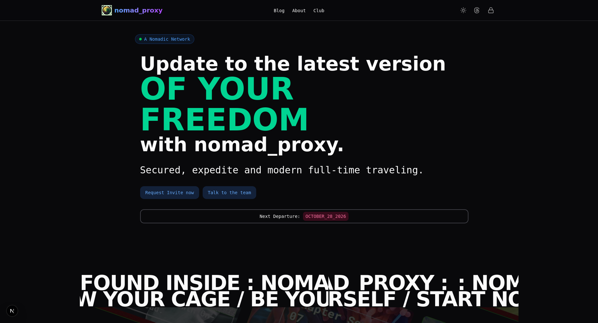

# Nomadic MDX Blog

A modern, full-stack blogging platform built with Next.js, TypeScript, and MDX. Designed for sharing insights about digital nomadism, travel, and lifestyle topics with a sleek, responsive interface.



## 🌍 Features

- **MDX-Powered Blog Posts** - Write blog content in Markdown with React component support
- **Responsive Design** - Mobile-first UI with Tailwind CSS and HeroUI components
- **Dark Mode Support** - Theme switching with persistent preferences
- **Admin Dashboard** - Authentication-protected admin interface for managing posts and leads
- **Authentication** - Secure login with NextAuth.js v5
- **Lead Management** - Capture and manage user leads/inquiries
- **Blog Statistics** - View post analytics and engagement metrics
- **SEO Ready** - Automatic slug generation and optimized meta tags
- **Code Highlighting** - Syntax highlighting for code blocks in blog posts
- **Accessibility** - Semantic HTML and WCAG compliance

## 🚀 Tech Stack

### Frontend
- **Framework:** Next.js 16+ with TypeScript
- **UI Components:** HeroUI 2, React 19
- **Styling:** Tailwind CSS 4, PostCSS
- **Forms:** React Hook Form with Zod validation
- **Animation:** Framer Motion, GSAP
- **Icons:** Lucide React, React Icons

### Content
- **MDX:** @next/mdx for rendering Markdown + React components
- **Processing:** 
  - `next-mdx-remote` for dynamic MDX rendering
  - `gray-matter` for YAML frontmatter parsing
  - `remark-gfm` for GitHub Flavored Markdown
  - `rehype-slug` for automatic heading IDs
  - `rehype-autolink-headings` for heading anchor links
  - `rehype-highlight` for code syntax highlighting

### Backend
- **Auth:** NextAuth.js v5 with credential-based authentication
- **Encryption:** bcryptjs for password hashing
- **Data Storage:** JSON-based (admin.json, leads.json)

### Development
- **Linting:** ESLint 9
- **Build Tool:** Turbopack (experimental)
- **Package Manager:** npm

## 📁 Project Structure

```
nomadic_mdx-blog/
├── src/
│   ├── app/                      # Next.js app directory
│   │   ├── (auth)/              # Authentication routes
│   │   ├── (main)/              # Main site routes
│   │   │   ├── blog/            # Blog listing & post pages
│   │   │   ├── about/           # About page
│   │   │   ├── club/            # Club/community section
│   │   │   ├── privacy-policy/
│   │   │   ├── terms-of-service/
│   │   │   ├── cookie-policy/
│   │   │   └── accessibility/
│   │   ├── admin/               # Admin dashboard
│   │   ├── api/                 # API routes
│   │   │   ├── auth/            # NextAuth configuration
│   │   │   └── admin/           # Admin endpoints (posts, leads, stats)
│   │   ├── layout.tsx           # Root layout
│   │   ├── providers.tsx        # App providers (theme, auth)
│   │   └── globals.css          # Global styles
│   │
│   ├── components/              # Reusable React components
│   │   ├── forms/               # Form components
│   │   ├── ui/                  # UI primitives
│   │   ├── mdx-components.tsx   # Custom MDX renderers
│   │   ├── BlogPostLayout.tsx   # Blog post template
│   │   ├── ThemeProvider.tsx
│   │   ├── ThemeSwitcher.tsx
│   │   └── ErrorBoundary.tsx
│   │
│   ├── content/
│   │   └── posts/               # MDX blog post files
│   │
│   ├── lib/                     # Utility functions & helpers
│   │
│   └── proxy.ts                 # Proxy configuration
│
├── data/
│   ├── admin.json              # Admin user credentials
│   └── leads.json              # Captured leads/inquiries
│
├── public/                      # Static assets
├── planning/                    # Project planning docs
├── next.config.ts              # Next.js configuration
├── tsconfig.json               # TypeScript configuration
├── tailwind.config.js          # Tailwind CSS configuration
├── postcss.config.mjs          # PostCSS configuration
├── eslint.config.mjs           # ESLint configuration
├── hero.ts                     # Hero configuration file
└── setup-admin.js              # Admin setup script

```

## 🛠️ Installation & Setup

### Prerequisites
- Node.js 18+ 
- npm or yarn

### Getting Started

1. **Clone the repository**
   ```bash
   git clone <repository-url>
   cd nomadic_mdx-blog
   ```

2. **Install dependencies**
   ```bash
   npm install
   ```

3. **Set up environment variables**
   Copy the example environment file and configure it:
   ```bash
   cp .env.example .env.local
   ```
   
   Edit `.env.local` with your own values:
   ```env
   # Generate a secure secret with: openssl rand -base64 32
   NEXTAUTH_SECRET=your_secret_key_here
   
   # NextAuth URL (change for production)
   NEXTAUTH_URL=http://localhost:3000
   
   # Admin credentials (stored in data/admin.json after setup)
   ADMIN_EMAIL=admin@nomadic.com
   ADMIN_PASSWORD=your_secure_password_here
   ```
   
   **Security Note:** `.env.local` is gitignored and should never be committed to version control.

4. **Initialize admin user** (optional)
   ```bash
   node setup-admin.js
   ```

5. **Start development server**
   ```bash
   npm run dev
   ```
   
   Open [http://localhost:3000](http://localhost:3000) in your browser.

## 📝 Creating Blog Posts

Blog posts are MDX files located in `src/content/posts/`. Each post should include YAML frontmatter:

```mdx
---
title: "Your Blog Title"
date: "2024-02-09"
description: "A brief description of your post"
author: "Author Name"
---

# Your content here

This is a paragraph with **bold** and *italic* text.

## Subheading

Code blocks are automatically syntax highlighted:

```typescript
const greeting: string = "Hello, World!";
console.log(greeting);
```
```

Posts are automatically transformed into pages at `/blog/[slug]` based on the filename.

## 🔑 Admin Features

Access the admin dashboard at `/login` after setup:

- **Post Management** - Create, edit, view, and delete blog posts
- **Lead Management** - View and manage captured user inquiries
- **Statistics** - View blog metrics and engagement data
- **Admin Credentials** - Stored securely in `data/admin.json`

## 📚 Available Scripts

```bash
npm run dev          # Start development server with hot reload
npm run build        # Build for production
npm start            # Start production server
npm run lint         # Run ESLint
```

## 🎨 Customization

### Theming
- Theme configuration in `src/components/ThemeProvider.tsx`
- Toggle dark/light mode with `ThemeSwitcher` component
- Tailwind CSS configuration in `tailwind.config.js`

### MDX Components
- Custom MDX renderers in `src/components/mdx-components.tsx`
- Extend with additional components as needed

### Styling
- Tailwind CSS for utility-first styling
- HeroUI for pre-built component library
- Custom CSS in `src/app/globals.css`

## 🔒 Security Notes

- Passwords are hashed with bcryptjs
- Admin credentials stored locally in JSON files
- NextAuth.js handles session management
- Environment variables for sensitive data (never commit to git)
- Use `.env.example` as a template for configuration
- Generate a secure NEXTAUTH_SECRET with: `openssl rand -base64 32`
- Always keep `.env.local` out of version control

## 🚀 Deployment

### Building for Production
```bash
npm run build
npm start
```

### Troubleshooting Build Issues
If you encounter ChunkLoadError with HeroUI dom-animation:
```bash
rm -rf .next
npm run build
```

### Deployment Platforms
This project can be deployed to:
- Vercel (recommended, Next.js native)
- Netlify
- Self-hosted servers
- Docker containers

## 📄 License

See [LICENSE](./LICENSE) file for details.

## 🤝 Contributing

Created by Armando Garrido - [GitHub](https://github.com/alef-garrido)
Contributions are welcome! Please ensure:
- Code follows the existing style
- TypeScript types are properly defined
- ESLint passes without errors
- Changes are tested before submitting

## 📬 Contact & Support

For issues, questions, or feature requests, please open an issue in the repository.

---

**Built with ❤️ for digital nomads and travel enthusiasts**
